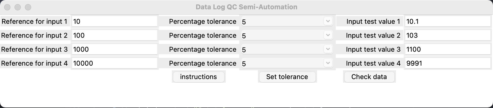
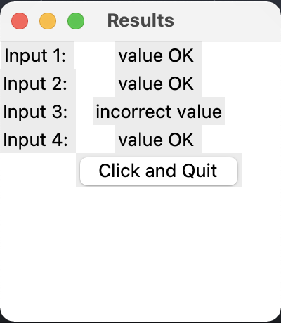

# DLoggerCheck

* A plain software for checking datalogger values during QC process
* Under Development
* Upcoming updates: generate report, read input from csv file, controlled number of inputs etc




```
